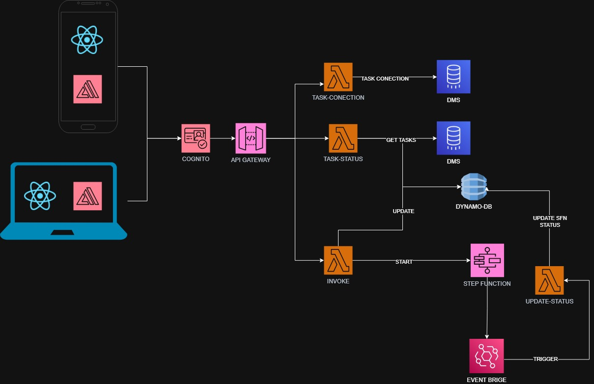

# DMS Task Monitor

> Um dashboard serverless para monitorar tarefas de replicação do AWS Database Migration Service (DMS) e iniciar fluxos controlados de recuperação.



## Visão geral

DMS Task Monitor oferece aos operadores um único lugar para verificar a saúde das tarefas de replicação do AWS DMS. Pelo dashboard, usuários autenticados consultam o status das tarefas, testam a conectividade e iniciam uma recuperação quando necessário.

A solução mantém o estado operacional no DynamoDB e utiliza AWS Step Functions com EventBridge para coordenar a recuperação e persistir seu status final.

## Arquitetura

1. Um cliente React autentica os usuários com Amazon Cognito.
2. O cliente chama endpoints REST protegidos pelo Amazon API Gateway.
3. Funções AWS Lambda consultam dados das tarefas DMS, realizam testes de conectividade e iniciam recuperações.
4. O status das tarefas e dos fluxos é armazenado no Amazon DynamoDB.
5. Um fluxo Step Functions executa a recuperação. Ao terminar, o EventBridge notifica uma Lambda, que mantém o status no DynamoDB atualizado.

## Stack

| Área | Tecnologias |
| --- | --- |
| Frontend | React 19, Vite, Tailwind CSS |
| API e computação | Amazon API Gateway, AWS Lambda, Python |
| Orquestração | AWS Step Functions, Amazon EventBridge |
| Dados | Amazon DynamoDB, AWS DMS |
| Autenticação | Amazon Cognito |
| Infraestrutura | Terraform |
| Testes | Pytest, Moto |

## Estrutura do repositório

```text
src/
├── frontend/        # Dashboard React
└── backend/         # Handlers Lambda e integrações AWS
infra/
├── modules/         # Módulos Terraform reutilizáveis
├── pipelines/       # Entradas Terraform por ambiente
└── mock/            # Infraestrutura e seeds locais
tests/               # Testes automatizados em Python
scripts/             # Utilitários locais e benchmarks
docs/                # Documentação e diagramas do projeto
```

## Como começar

### Frontend

```bash
cd src/frontend
npm install
npm run dev
```

Crie um arquivo de ambiente local com as variáveis utilizadas por `src/frontend/src/cognitoConfig.jsx`. Nunca versione esse arquivo.

### Testes do backend

```bash
python -m venv .venv
.venv\\Scripts\\activate        # Windows PowerShell
pip install -r requirements.txt
pytest
```

### Infraestrutura

Cada ambiente é definido em `infra/pipelines`. Forneça a configuração por um arquivo local `*.tfvars` ou pelo cofre de segredos do CI/CD e use o fluxo padrão do Terraform:

```bash
terraform -chdir=infra/pipelines/dev init
terraform -chdir=infra/pipelines/dev plan
```

## Segurança

- Não versione arquivos `.env`, credenciais AWS, chaves privadas, tokens de acesso ou arquivos `*.tfvars` reais.
- Mantenha os endpoints do API Gateway protegidos pelo Cognito fora do desenvolvimento local.
- Revise os planos do Terraform antes de aplicar alterações na infraestrutura.
- Conceda a cada Lambda somente as permissões IAM necessárias.

## Comandos disponíveis

| Comando | Descrição |
| --- | --- |
| `npm run dev` | Inicia o servidor de desenvolvimento do frontend |
| `npm run build` | Gera a versão de produção do frontend |
| `npm run lint` | Executa o lint do frontend |
| `pytest` | Executa a suíte de testes do backend |

## Licença

Distribuído sob a [licença MIT](LICENSE).
